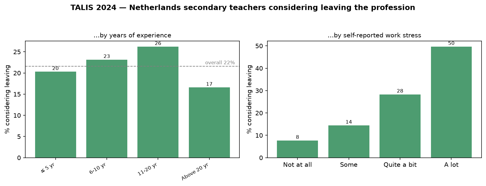

# What keeps Dutch teachers in the classroom?

**Modifiable working conditions and teachers' intention to leave the profession | OECD TALIS 2024, Netherlands.**

Exploring the Dutch teacher shortage (*lerarentekort*, my research interests lie in understanding **which conditions,
that we can actually change, predict a teacher thinking about leaving?**

This analysis separates **modifiable working conditions** (stress, mental-health strain,
work–life balance, recognition, autonomy, pay, leadership, classroom disruption,
workload) from **fixed background characteristics** (age, experience, whether teaching was a first-choice career), and estimates how each relates to the intention to leave.

---

## Headline findings

Among **2,576 Dutch secondary teachers**, **≈22% agree or strongly agree** that they
*"wonder whether it would be better to choose another profession"* (TALIS item TT4G27-block,
`TT4G78F`). The risk is not evenly spread, and it tracks **strain and
recognition far more than pay or autonomy.**

**1. It rises steeply with stress, and peaks mid-career.**

| Self-reported work stress | % considering leaving |
|---|---|
| Not at all | 8% |
| To some extent | 14% |
| Quite a bit | 28% |
| A lot | **50%** |

By experience: ≤5 yrs 20% · 6–10 yrs 23% · **11–20 yrs 26%** · 20+ yrs 17%.
Attrition risk is highest in *mid-career*, not (as often assumed) only among new teachers.

**2. Adjusted odds ratios (weighted logistic regression, per 1 SD, BRR 95% CI):**

| Predictor | OR | 95% CI | |
|---|---|---|---|
| Job harms mental health | **1.64** | 1.44–1.87 |  modifiable |
| Work stress | **1.53** | 1.27–1.84 |  modifiable |
| Classroom disruption / lost time | 1.21 | 1.00–1.47 |  modifiable |
| Feels valued by society | **0.78** | 0.69–0.88 |  modifiable (protective) |
| Weekly working hours | 0.79 | 0.65–0.95 |  modifiable (see note) |
| Teaching was first-choice career | 0.67 | 0.46–0.97 |  fixed |
| Age (grouped) | 0.78 | 0.62–0.98 |  fixed |
| Classroom autonomy | 0.89 | 0.78–1.02 |  *n.s.* |
| Salary satisfaction | 0.88 | 0.73–1.06 |  *n.s.* |
| Supportive school leadership | 1.08 | 0.93–1.25 |  *n.s.* |
| Time for personal life | 1.12 | 0.93–1.36 |  *n.s.* |
| Years of experience | 1.06 | 0.87–1.29 |  *n.s.* |

**Takeaway:** the strongest modifiable predictors are **psychological strain**
(mental-health impact and work stress) and **feeling valued by society**. The levers that
dominate the public debate, **salary, autonomy, and school leadership**, show **no
significant association** with considering leaving once strain and recognition are
accounted for. This points retention policy toward *workload/strain reduction and
professional respect* rather than pay or autonomy alone.





---

## Descriptive statistics

**Dataset.** OECD TALIS 2024 — Teaching and Learning International Survey, international
teacher file (`ttgintt4.csv`). The survey covers lower-secondary (ISCED 2) teachers across
participating OECD countries. This analysis is restricted to the **Netherlands**
(`CNTRY == "NLD"`), n = **2,576** teachers, weighted by the final teacher weight (`TCHWGT`).
Data must be downloaded from the OECD (see *Reproduce*); microdata are not redistributed here.

**Outcome distribution.** The primary outcome (`TT4G78F`) — *"I wonder whether it would
be better to choose another profession"*, is a 4-point Likert scale (1 = strongly disagree
to 4 = strongly agree). Weighted prevalence of *agree / strongly agree* (the "considering
leaving" group): **≈ 22%**.

**Key predictor sources.**

| Block | Items | n available |
|---|---|---|
| Universal (all teachers) | Work stress, mental-health impact, work–life balance, societal recognition, age group, experience | ≈ 2,250 |
| Rotated form A/B | Classroom autonomy (mean of 5 items), classroom disruption | ≈ 1,505 |
| Rotated form C | Salary satisfaction, weekly working hours, school leadership | ≈ 1,460–1,490 |
| Rotated form (select) | Teaching was first-choice career | ≈ 1,460 |

**Missing-data conventions.** The CSV export carries no value labels; TALIS reserved missing
codes (6–9 for single-digit items; 996–999 for wide count fields) are recoded to `NaN` before
analysis. Gender and contract tenure are fully suppressed in the Netherlands file and excluded.


## Method

- **Data:** OECD TALIS 2024 international teacher file (`ttgintt4.csv`, the CSV export),
  Netherlands (`CNTRY == "NLD"`), lower-secondary teachers, n = 2,576. TALIS surveys
  **lower-secondary (ISCED 2)** teachers; the labour-market context cited here (the 5.1→3.5%
  shortage, *tekortvakken*) covers **secondary education (VO) as a whole**, so the sample is
  treated as informative about the full VO population. Analytic n varies
  by item: ≈2,250 for the universal base model, 1,460–1,505 for each rotated lever.
- **Outcome:** `TT4G78F` — *"I wonder whether it would be better to choose another
  profession"* (1–4). Primary model dichotomises *agree / strongly agree* = "considering
  leaving."
- **Estimation:** survey-weighted logistic regression using the final teacher weight
  (`TCHWGT`). Continuous predictors are z-scored, so odds ratios are **per 1 SD**.
- **Standard errors:** TALIS's **100 balanced-repeated-replication (BRR) weights**
  (`TRWGT1`–`TRWGT100`, Fay's *k* = 0.5), i.e. the design-correct variance, not naïve
  model SEs.
- **Rotated forms:** TALIS 2024 rotates question blocks. The well-being/recognition items
  are asked of nearly all teachers (n ≈ 2,250), but the job-design items (autonomy, pay,
  hours, leadership, disruption) sit in rotated forms that **do not all co-occur**. The
  design therefore fits one well-powered **base model** on the universal items and **adds
  each rotated lever** to that base on its own subsample (n ≈ 1,460–1,505). This avoids
  collapsing the sample to zero via listwise deletion.
- **Missing data:** the CSV export carries no value labels, so TALIS's reserved missing
  codes appear as numbers — 6–9 for single-digit items (`8` = "not administered" on rotated
  forms, `9` = "omitted/invalid") and 996–999 for the wide count fields (hours, years).
  Substantive values never reach those ranges, so recoding them to missing exactly
  reproduces the value-label handling of the `.sav` file. Gender and contract tenure are
  fully suppressed in the NL file and are excluded.
- **Robustness:** (1) an ordinal proportional-odds model on the full 4-point item
  reproduces the direction and significance of the main effects; (2) a second, independent
  outcome— `TT4G74`, *years the teacher intends to keep teaching*— correlates negatively
  with stress, consistent with the primary result.

### Limitations
Cross-sectional self-report: "Job harms mental health" is conceptually close to the outcome 
and partly mediates rather than confounds. Rotated-form subsamples reduce power for the 
job-design levers, so some null results may reflect limited power rather than true absence of effect. 
Age and experience are strongly collinear and both enter the base model, which inflates the variance 
on each- their individual coefficients should be read jointly, instead if as independent effects. Experience is
also modelled as a single linear term, so the descriptive mid-career peak (highest at 11–20 years) is not 
formally tested and is reported as a signal only.

---

## Reproduce

```bash
# 1. Download the TALIS 2024 international teacher file (CSV export) from the OECD:
#    https://www.oecd.org/en/about/programmes/talis/talis-2024-database.html
#    Place it at: datasets/SPSS/TALIS2024_teachers_NoESE_CSV/ttgintt4.csv
# 2. Environment:
pip install -r requirements.txt
# 3. Run:
python analysis.py
```

Outputs: `figures/fig1_landscape.png`, `figures/fig2_oddsratios.png`,
`outputs/odds_ratios.csv`, `outputs/ordinal_robustness.csv`.

---

## License

Code and documentation: [MIT](LICENSE). The OECD TALIS 2024 microdata is © OECD, is not
redistributed in this repository, and must be obtained from the OECD under their terms of
use (see *Reproduce*).

---

*Author: Fatima Mashood, 2026. Data: © OECD, TALIS 2024.*
*Companion analysis: [TALIS-2024-analysis](https://github.com/FatimaMashood/TALIS-2024-analysis) (professional development & assessment self-efficacy).*
