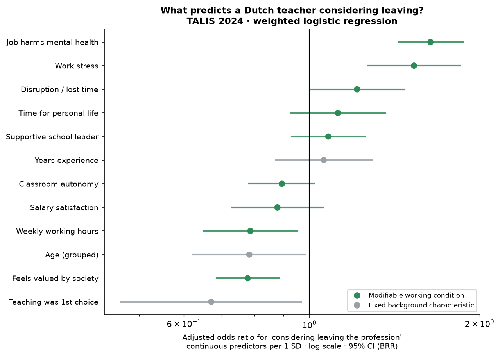

# Strain, not salary: what actually keeps Dutch teachers in the classroom

### Independent policy brief and reproducible analysis framework | OECD TALIS 2024, Netherlands

Author: Fatima Mashood · June 2026 · Find the full analysis in [`README.md`](README.md) and [`analysis.py`](analysis.py)

Target audience: school boards, the VO-raad, and the Ministry of Education (OCW)

---

> ## Key messages
>
> - The intention to leave teaching is driven by **psychological strain and feeling
>   under-valued**, far more than by pay, autonomy, or school leadership. Among 2,576
>   Dutch secondary teachers, the share considering leaving rises from **8% to 50%** as
>   reported work stress goes from "none" to "a lot."
> - The risk is **highest mid-career (11–20 years), not among newcomers**, though this is
>   a descriptive pattern, experience itself is not a significant predictor once strain is
>   accounted for.
> - Once strain and recognition are accounted for, **salary satisfaction, classroom
>   autonomy and supportive leadership show *no* significant association** with
>   considering leaving, contrary to the dominant public debate that shapes long-term
>   policy.
> - The 2025 dip in the shortage is a **one-off, demand-side reprieve
>   to the wider problem; official projections expect the secondary shortage to rise
>   again toward 2029 (CentERdata/OCW, 2024).

---

## About the research

This project uses the OECD's **TALIS 2024** survey, the world's largest international study
of teachers and school leaders, to identify which modifiable working conditions predict a
Dutch lower-secondary teacher's intention to leave the profession.

The repository contains:
- **`analysis.py`**: fully reproducible Python script: data loading, variable construction,
  survey-weighted logistic regression with 100 BRR replicate weights, ordinal robustness
  check, and figure generation.
- **`README.md`**: headline findings, full methods, descriptive statistics, limitations,
  and reproduction instructions.
- **`brief.md`**: a policy brief summarising findings for school boards,
  the VO-raad, and the Ministry of Education (OCW).
- **`outputs/`** `odds_ratios.csv` and `ordinal_robustness.csv` (model results).
- **`figures/`** `fig1_landscape.png` (descriptive overview) and `fig2_oddsratios.png`
  (forest plot of adjusted odds ratios).

The dataset (`ttgintt4.csv`) is © OECD and is not redistributed in this repository.
See *Reproduce* in `README.md` for download instructions.

## Context for research

The discourse on the Dutch teacher shortage, the *lerarentekort*, often settles on
teachers being "unhappy" or "underpaid," and the policy response has leaned heavily on
**pay and structure**. Since 2023, primary-school salaries rose by roughly **10%** and
the historic pay gap between primary and secondary teachers was closed (CNV, 2023); the
government also rolled out regional *Onderwijsregio's* to coordinate recruitment and a
national programme to strengthen the profession (Rijksoverheid, 2024).

Between 2024 and 2025, the secondary-education shortage **fell from 5.1% to 3.5%**
(VO-raad, 2025). Though widely perceived as progress, the sector body and the ministry
explained it as a **temporary, demand-driven dip**; owing to falling pupil numbers and
the end of pandemic-era (NPO) funding, rather than to improvements in teacher retention.

Furthermore, teacher unemployment-benefit (WW) claims **rose in 2025 for the first time since 2019** (AOb, 2025), 
suggesting that qualified teachers are unemployed while the Dutch teacher shortage persists. Meanwhile roughly
**two-thirds of the remaining shortage is "hidden,"** absorbed as higher workload and rising burnout among the 
teachers who stay (VO-raad, 2025). The shortages remain concentrated in the *tekortvakken* (mathematics, physics,
chemistry, computer science, languages) and the largest cities rather than spread evenly (VO-raad, 2025; Voion/OCW, 2025).
Official forecasts expect the secondary shortage to climb again, to about 2,900 FTE around 2029 and ~3,500 FTE by
2034 (CentERdata/OCW, 2024).

## Research Question
*of the working conditions schools and policymakers can actually
change, which ones predict a teacher thinking about leaving?*

My process involved statistically separating **modifiable working conditions** (stress, mental-health
strain, recognition, workload, autonomy, pay, leadership, classroom disruption) from
**fixed background characteristics** (age, experience, whether teaching was a first-choice career),
using the OECD's TALIS 2024 survey of Dutch teachers (OECD, 2024).

## What the evidence shows

Among **2,576 Dutch lower-secondary teachers, about 1 in 5 (22%)** agree they "wonder
whether it would be better to choose another profession." 

### Key findings:
**1. Risk rises steeply with strain.** As self-reported work stress increases, the share
considering leaving climbs sharply:

| Self-reported work stress | Considering leaving |
|---|---|
| Not at all | 8% |
| To some extent | 14% |
| Quite a bit | 28% |
| A lot | **50%** |

In the adjusted model, *"my job harms my mental health"* and *work stress* are the two
strongest predictors of all — each raising the odds of considering leaving by roughly
**50–65% per one-standard-deviation increase**, holding everything else constant.

**2. The risk builds through mid-career and only eases among veterans.** By years of
experience, the share considering leaving is:

| Years of experience | Considering leaving |
|---|---|
| ≤5 yrs | 20% |
| 6–10 yrs | 23% |
| 11–20 yrs | **26%** |
| 20+ yrs | 17% |

In the adjusted model, years of experience is *not* a significant predictor (OR 1.06, 95% CI 0.87–1.29). 

**3. Recognition rather than pay, autonomy and leadership.**
Teachers who feel **valued by society** are significantly *less* likely to consider leaving.
By contrast, once strain and recognition are accounted for, **salary satisfaction, classroom autonomy,
and supportive school leadership show no significant association** with considering leaving.

*Adjusted odds ratios (per 1 SD, 95% CI). Green = modifiable working condition; grey =
fixed background. Points right of the line raise the odds of considering leaving; left
of it, lower them. Strain (top) dominates; pay/autonomy/leadership cross the line of no
effect.*

## What experts recommend

These priorities are drawn from the Dutch government's official education advisory
council (the **Onderwijsraad**) and recent peer-reviewed research, and they align closely
with what this analysis finds.

**At a glance:**
1. **Cut workload** by letting teachers focus on their core task.
2. **Enrich jobs** rather than relying on further pay rises.
3. **Make retention a shared, funded responsibility** of boards, school leaders and government.
4. **Invest in the status and attractiveness** of the profession.

**Reduce workload by letting teachers focus on their core task.** The Onderwijsraad's
advice *Schaarste schuurt* argues the shortage cannot be solved short-term and calls for
**sharp choices in the curriculum** and **reorganising school work** so teachers can
concentrate on teaching, with other staff taking on supporting tasks (Onderwijsraad,
2023).

**Job enrichment rather than pay.** A two-wave study of 637 Dutch teachers found that
**job enrichment raised satisfaction and engagement and lowered intention to leave**,
without increasing burnout when well managed (Erasmus University Rotterdam, 2025).

**Make it a shared responsibility of boards, school leaders and government, backed by
structural funding.** The Onderwijsraad places "leadership and vision" on
administrators, school leaders and the state, and calls for **adequate, structural
funding** with extra support for vulnerable schools (Onderwijsraad, 2023). For *school
boards*, that means treating teacher strain and workload as a governed, measured
retention risk; for *national policy*, it means recognising that the post-2023 pay rises
did not prevent shortages projected to rise again (CentERdata/OCW, 2024).

**Invest in the status and attractiveness of the profession.** The Onderwijsraad argues
more must be done to improve the attractiveness of working in education (Onderwijsraad,
2023).

### For future research
- **Validate the strain–retention link longitudinally.** The single most consistent
  result that teacher strain and workload are the strongest predictors of intention to leave is cross-sectional. Validating that teacher strain and workload are the strongest predictors of intention to leave,  with panel data (do teachers reporting high strain actually leave at higher rates?) could potentially help develop causal evidence that could justify board- and ministry-level workload targets.

## How robust is this?

- **Data & method.** OECD TALIS 2024, 2,576 Dutch lower-secondary teachers (OECD, 2024).
  Survey-weighted logistic regression using TALIS's final teacher weight, with
  design-correct (balanced-repeated-replication) confidence intervals.
- **Confirmed two ways.** An ordinal model on the full 4-point response scale and a
  separate outcome— the number of years a teacher intends to keep teaching— both
  reproduce the main result.
- **Key limits.** The survey is **cross-sectional self-report**, so these are
  **associations, not proven causes**. *"My job harms my mental health"* sits close to
  the outcome and may lie *on the pathway* to leaving rather than be a separate cause.
  The job-design levers (pay, autonomy, leadership) were asked of smaller sub-samples, so
  a null result can reflect limited statistical power as well as a genuine absence of
  effect.

> **Author's note (personal reflection).** 
> I have deliberately built the recommendations above on established expert bodies rather than
> my own judgement. My initial read of the TALIS 2024 data pointed to a continuing
> shortage; only through further, iterative research did I find the 2025 dip- and then
> learn that it is widely read as temporary and demand-driven rather than a genuine
> improvement. Methodologically, I separated *modifiable* from *fixed* conditions
> because only the former can become policy, used TALIS's replicate weights so the
> uncertainty reflects the survey's complex design, and checked the headline against a
> second outcome. What surprised me most was that pay, autonomy and leadership
> had little effect once strain and recognition were in the model.

**Transparency & AI use.** The analysis, modelling choices and conclusions are my own.
AI tools were used as an assistant for code review, all statistical results were produced by the reproducible code in [`analysis.py`](analysis.py) and every source was checked against the original publication (verified June 2026).

---

### Sources

In-text references correspond to the sources below (all verified June 2026).

1. AOb (Algemene Onderwijsbond). (2025, 9 December). *Ondanks grote lerarentekorten meer
   leraren met een WW-uitkering.* https://www.aob.nl/en/actueel/artikelen/ondanks-grote-lerarentekorten-meer-leraren-met-een-ww-uitkering/
2. CentERdata / OCW in cijfers. (2024, 17 December). *Prognoses arbeidsmarkt vo*
   [teacher labour-market forecasts, secondary education]. Ministerie van OCW.
   https://www.ocwincijfers.nl/sectoren/voortgezet-onderwijs/personeel/prognoses-arbeidsmarkt-vo
3. CNV. (2023). *Cao-akkoorden po en vo: 10% loonsverhoging.*
   https://www.cnv.nl/onderwijs/voortgezet-onderwijs/nieuws/cao-akkoorden-po-en-vo-10-loonsverhoging-voor-voortgezet-onderwijs/
4. Erasmus University Rotterdam. (2025, 20 March). *Job enrichment as a solution to the
   teacher shortage* [reporting van den Elsen, J., Vermeeren, B., & Steijn, B.,
   "Retaining teachers: Does enriching teachers' jobs contribute?"].
   https://www.eur.nl/en/news/job-enrichment-solution-teacher-shortage
5. OECD. (2024). *TALIS 2024 database — international teacher file (Netherlands).* OECD
   Publishing. https://www.oecd.org/en/about/programmes/talis.html
6. Onderwijsraad. (2023). *Schaarste schuurt* [advice on the teacher shortage], as
   reported by VO-raad (2023, 5 July). https://www.vo-raad.nl/nieuws/onderwijsraad-ongemakkelijke-keuzes-nodig-in-aanpak-lerarentekort
7. Rijksoverheid. (2024). *Aanpak tekort aan leraren* [incl. Onderwijsregio's and
   national professionalisation programme].
   https://www.rijksoverheid.nl/onderwerpen/werken-in-het-onderwijs/aanpak-tekort-aan-leraren
8. VO-raad. (2025, 18 December). *Tijdelijke afname tekorten met grote regionale
   verschillen.* https://www.vo-raad.nl/nieuws/tijdelijke-afname-tekorten-met-grote-regionale-verschillen
9. Voion / Ministerie van OCW. (2025). *Trendrapportage Arbeidsmarkt leraren po, vo en
   mbo 2025.* https://www.voion.nl/publicaties/trendrapportage-arbeidsmarkt-leraren-po-vo-en-mbo-2025

**Full analysis & reproducible code:** [`README.md`](README.md) · [`analysis.py`](analysis.py).
Data: © OECD, *TALIS 2024*.
**Contact:** Fatima Mashood · ‹famamashood@proton.me / www.linkedin.com/in/famamashood / https://github.com/FatimaMashood›
